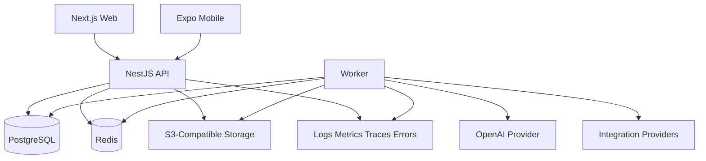

# Arete Architecture Overview

Arete is curriculum-neutral. Schools define their own classes, subjects, chapters, topics, syllabus, and materials.

Core security invariant: every school-owned resource is tenant-scoped and every server-side read/write verifies the user, school membership, role, permission, and exact resource relationship.
